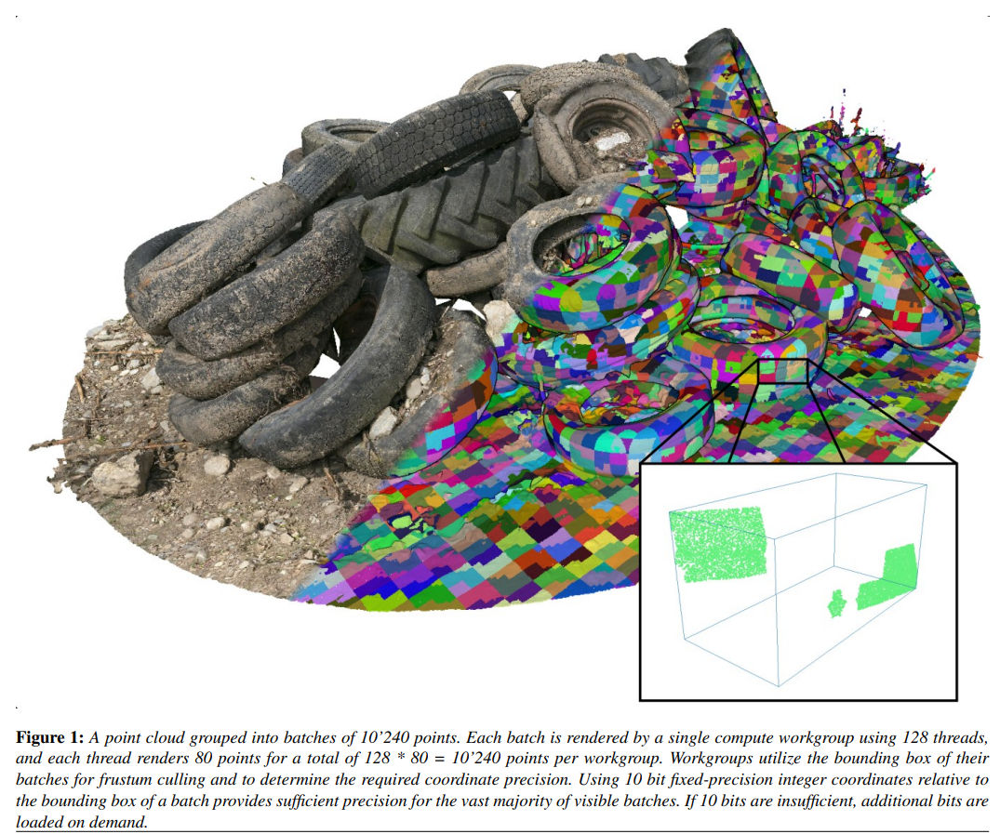

# About

This repository contains the source code for our papers about real-time software rasterization of point clouds, which can be 10 to 100 times faster than GL_POINTS. This is possible because GL_POINTS is built upon the triangle-oriented rendering pipeline that is not optimal for pixel-sized points.

The basic idea is to spawn a compute shader that transforms points to screen space, encodes depth and color into a single 64 bit integer, and uses atomicMin to compute the closest point for each pixel. The color value is then extracted from the interleaved depth+color buffer and converted into a regular OpenGL texture for display. 

The latest improvement also groups about 10k points into batches, and each compute workgroup(128 threads) renders a batch(10k points), i.e., each thread renders about 80 points. This allows several batch-level optimizations such as frustum culling, LOD rendering, and adaptive precision. Adaptive precision picks a sufficient coordinate precision (typically just 10 bit per axis) depending on the projected batch size, which boosts brute-force performance due to lower memory bandwidth requirements.

The main branch is a slightly more user friendly version that allows loading LAS files via drag&drop. Other branches contain snapshots of the code made after evaluations for specific paper submissions:

* ["Software Rasterization of 2 Billion Points in Real-Time"](https://www.cg.tuwien.ac.at/research/publications/2022/SCHUETZ-2022-PCC/)  
In branch [compute_rasterizer_2022](https://github.com/m-schuetz/compute_rasterizer/tree/compute_rasterizer_2022) 
[paper](https://www.cg.tuwien.ac.at/research/publications/2022/SCHUETZ-2022-PCC/) - <a href="https://www.youtube.com/watch?v=9h-ElMfVIOY">video</a>

* ["Rendering Point Clouds with Compute Shaders and Vertex Order Optimization"](https://www.cg.tuwien.ac.at/research/publications/2021/SCHUETZ-2021-PCC/) 
In branch [compute_rasterizer_2021](https://github.com/m-schuetz/compute_rasterizer/tree/compute_rasterizer_2021)

# Features and Limitations

* Renders up to one billion points in about 8 milliseconds (hence 2 billion points in real-time, 60fps) on an RTX 3090.
* You need to make sure not to load more than your GPU memory can handle. You'll need about 1.6GB for every 100 million points, plus 1GB or 2GB overhead. 
* Drag & Drop a LAS or LAZ files into the window to load it. Only RGB attributes are displayed.
* Requires Windows and NVIDIA GPUs. Pull requests for AMD support are welcome.

# Building

* Clone the repository
* Compile build/ComputeRasterizer.sln with Visual Studio 2022.
* Run (ctrl + f5)

<table>
	<tr>
		<th>Method</th>
		<th>Location</th>
		<th></th>
	</tr>
	<tr>
		<td>basic</td>
		<td><a href="./modules/compute_loop_las">./modules/compute_loop_las</a></td>
		<td></td>
	</tr>
	<tr>
		<td>prefetch</td>
		<td><a href="./modules/compute_loop_las2">./modules/compute_loop_las2</a></td>
		<td>fastest, each thread fetches 4 points at a time</td>
	</tr>
	<tr>
		<td>hqs</td>
		<td><a href="./modules/compute_loop_las_hqs">./modules/compute_loop_las_hqs</a></td>
		<td>High-Quality Shading</td>
	</tr>
	<tr>
		<td>LOD</td>
		<td><a href="./modules/compute_loop_nodes">./modules/compute_loop_nodes</a></td>
		<td>Support for the Potree LOD format</td>
	</tr>
	<tr>
		<td>LOD hqs</td>
		<td><a href="./modules/compute_loop_nodes_hqs">./modules/compute_loop_nodes_hqs</a></td>
	</tr>
</table>

# Citing
<pre>
@article{SCHUETZ-2022-PCC,
  title =      "Software Rasterization of 2 Billion Points in Real Time",
  author =     "Markus Sch\"{u}tz and Bernhard Kerbl and Michael Wimmer",
  year =       "2022",
  month =      jul,
  journal =    "Proc. ACM Comput. Graph. Interact. Tech.",
  volume =     "5",
  pages =      "1--16",
  URL =        "https://www.cg.tuwien.ac.at/research/publications/2022/SCHUETZ-2022-PCC/",
}

@article{SCHUETZ-2021-PCC,
  title =      "Rendering Point Clouds with Compute Shaders and Vertex Order Optimization",
  author =     "Markus Sch\"{u}tz and Bernhard Kerbl and Michael Wimmer",
  year =       "2021",
  month =      jul,
  doi =        "10.1111/cgf.14345",
  journal =    "Computer Graphics Forum",
  number =     "4",
  volume =     "40",
  pages =      "115--126",
  keywords =   "point-based rendering, compute shader, real-time rendering",
  URL =        "https://www.cg.tuwien.ac.at/research/publications/2021/SCHUETZ-2021-PCC/",
}

<pre>
