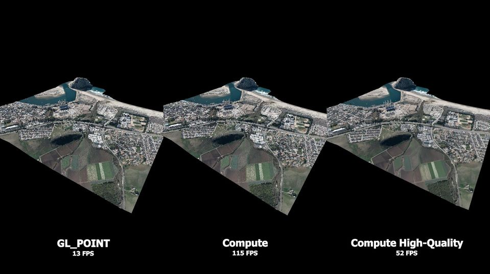

# About

[Two page abstract at arXiv](https://arxiv.org/abs/1908.02681)

This repository contains two variations on how to render point clouds with compute shaders that are up to ten times faster than gl.drawArrays(GL_POINT, ...). In the folders _compute_ and _compute_hqs_ you will find a regular non-anti-aliased version and a high-quality splatting version.

Please note that benchmarking results were obtained with the original order of points in our test files and for pixel sizes of 1 pixel. The order of points has a significant impact on performance and shuffling points severely reduces the performance gains of our compute shader approach. It can even make the high-quality compute shader version slower than the regular gl.drawArrays(GL_POINT, ...). In-depth benchmarking is subject to future work. 

This repository is an excerpt of the compute shader rasterization part of https://github.com/m-schuetz/Fenek/. 

Video (YouTube):

# compute

Up to 2-10 times faster than GL_POINT.

* render.cs: Encodes depth and colors into a 64 bit integer, and stores the closest fragment into an SSBO with atomicMin. 
* resolve.cs: Transfers color values from the SSBO to an actual OpenGL texture.

# compute_hqs

Up to 2-3 times faster than GL_POINT.

A compute shader implementation of _High-Quality Surface Splatting on Today’s GPUs_[2]. Instead of rendering only the closest point, this approach computes the average of all points within a certain depth-range, which leads to pretty good anti-aliasing within a pixel. Currently doesn't do anti-aliasing between pixels, though.

* render_depth.cs: Creates a depth-buffer using the basic compute approach.
* render_attribute.cs: Computes the sum of colors of all points that are at most 1% behind the closest point in a pixel. Also counts how many points contribute to the sum.
* resolve.cs: Computes the average color of contributing points via: _sum(colors) / length(colors)_. Writes the result into an OpenGL texture.

# Benchmark

* Our renderer uses OpenGL 4.5 via glew and glfw, C++, V8 Javascript Engine. See https://github.com/m-schuetz/Fenek/.
* Tested on an RTX 2080 TI and a GTX 1060.
* Points in the test files we used were somewhat ordered, altough we do not know the means by which they were ordered. Shuffling drastically changes the results. 
* Evaluated for a size of 1 pixel per point. The compute shader based approach scales roughly linearly with the point size/fragment count, whereas GL_POINT scales much better. So our approach is ideal for a size of 1 pixel per point, but the usefulness diminishes for sizes larger than 2x2 pixels.
* The Retz model was reduced to 100M points on the GTX 1060 (3GB) because of memory constraints.

| Model         | #Points | GPU           | AtomicMin  | High-Quality Splatting | GL_POINT  |
| ------------  | -------:|:--------------| ----------:| ---------:| ---------:|
| Heidentor     |     26M | 2080 TI       |  1.64 ms   |   3.37 ms |   5.71 ms |
|               |         | 1060 GTX      |  4.88 ms   |  11.78 ms |  13.60 ms |
| Retz          |    145M | 2080 TI       |  6.41 ms   |  12.95 ms |  34.04 ms |
|               |    100M | 1060 GTX      | 14.32 ms   |  31.76 ms |  58.82 ms |
| Morro Bay     |    117M | 2080 TI       | 5.87 ms    |  15.48 ms |  60.26 ms |

# References

* [1] [Markus Schütz, Michael Wimmer, "Rendering Point Clouds with Compute Shaders", arXiv](https://arxiv.org/abs/1908.02681)
* [2] Mario Botsch, Alexander Hornung, Matthias Zwicker, Leif Kobbelt, "High-Quality Surface Splatting on Today’s GPUs", Eurographics Symposium on Point-Based Graphics (2005)
* [3] Christian M Günther, Thomas Kanzok, Lars Linsen, and Paul Rosenthal. 2013. "A GPGPU-based Pipeline for Accelerated Rendering of Point Clouds." Journal of WSCG 21 (2013), 153–161.

