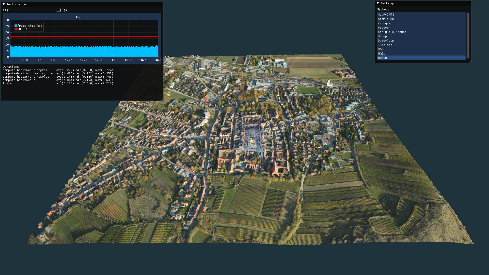
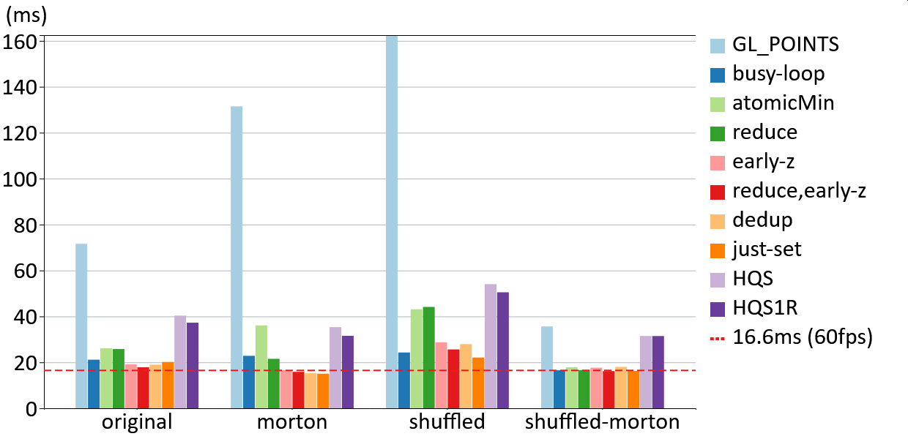

# Compute Shader Based Point Cloud Rendering

This repository contains the source code to our paper: <br>
[Rendering Point Clouds with Compute Shaders and Vertex Order Optimization](https://www.cg.tuwien.ac.at/research/publications/2021/SCHUETZ-2021-PCC/) <br>Markus Schütz, Bernhard Kerbl, Michael Wimmer. [EGSR '21](https://diglib.eg.org/handle/10.1111/cgf14345).

* Compute shaders can render point clouds up to an order of magnitude faster than GL_POINTS.
* With a combination of warp-wide deduplication and early-z, compute shaders able to render 796 million points (12.7GB) at stable 62 to 64 frames per second in various different viewpoints on an RTX 3090. This corresponds to a memory bandwidth utilization of about 802GB/s, or a throughput of about 50 billion points per second. 
* The vertex order also strongly affects the performance. Some locality of points that are consecutive in memory is beneficial, but excessive locality can result in drastic slowdowns if it leads to thousands of GPU threads attempting to update a single pixel. As such, neither Morton ordered nor shuffled buffers are optimal. However combining both by first sorting by Morton code, and then shuffling batches of 128 points but leaving points within a batch in order, results in an improved ordering that ensures high performance with our compute approaches, and it also increases the performance of GL_POINTS by up to 5 times.

### Uses

* _"ADOP: Approximate Differentiable One-Pixel Point Rendering"_, Darius Rückert, Linus Franke, Marc Stamminger, [arxiv](https://arxiv.org/abs/2110.06635) <br>
  Uses compute-based point rasterization to efficiently generate a set of sparse neural images, which are the basis for a high-quality reconstruction of a novel view image. 

# About the Framework

This framework is written in C++ and JavaScript (using V8). Most of the rendering is done in JavaScript with bindings to OpenGL 4.5 functions. It is written with live-coding in mind, so many javascript files are immediately executed at runtime as soon as they are saved by any text editor. As such, code has to be written with repeated execution in mind. 


# Getting Started

* Compile Skye.sln project with Visual Studio. 
* Open the workspace in vscode. 
* Open "load_pointcloud.js" (quick search files via ctrl + e).
    * Adapt the ```path``` to the correct location of the las file. 
	* Adapt ```position``` and ```lookAt``` to a viewpoint that fits your point cloud.
    * Change ```window.x``` to something that fits your monitor setup, e.g., 0 if you've got a single monitor, or 2540 if you've got two monitors and your first one has a with of 2540 pixels. 
* Press "Ctrl + Shift + B" to start the app. You should be seing an empty green window. (window.x is not yet applied)
* Once you save "load_pointcloud.js" via ctrl+s, it will be executed, the window will be repositioned, and the point cloud will be loaded. 
* You can change position and lookAt at runtime and apply them by simply saving load_pointcloud.js again. The pointcloud will not be loaded again - to do so, you'll need to restart first. 

After loading the point cloud, you should be seeing something like the screenshot below. The framework includes an IMGUI window with frame times, and another window that lets you switch between various rendering methods. Best try with data sets with tens of millions or hundreds of millions of points!



# Code Sections

Code for the individual rendering methods is primarily found in the modules/compute_\<methods\> folders. 

| Method        | Location      |
| ------------- |:-------------|
| atomicMin          | [./modules/compute](./modules/compute) |
| reduce             | [./modules/compute_ballot](./modules/compute_ballot) |
| early-z            | [./modules/compute_earlyDepth](./modules/compute_earlyDepth) |
| reduce & early-z   | [./modules/compute_ballot_earlyDepth](./modules/compute_ballot_earlyDepth) |
| dedup              | [./modules/compute_ballot_earlyDepth_dedup](./modules/compute_ballot_earlyDepth_dedup) |
| HQS                | [./modules/compute_hqs](./modules/compute_hqs) |
| HQS1R              | [./modules/compute_hqs_1x64bit_fast](./modules/compute_hqs_1x64bit_fast) |
| busy-loop          | [./modules/compute_guenther](./modules/compute_guenther) |
| just-set           | [./modules/compute_just_set](./modules/compute_just_set) |

# Results

Frame times when rendering 796 million points on an RTX 3090 in a close-up viewpoint. Times in milliseconds, lower is better. The compute methods reduce (with early-z) and dedup (with early-z) yield the best results with Morton order (<16.6ms, >60fps). The shuffled Morton order greatly improves performance of GL_POINTS and some compute methods, and it is usually either the fastest or within close margins of the fastest combinations of rendering method and ordering.

Not depicted is that the dedup method is the most stable approach that continuously maintains >60fps in all viewpoints, while the performance of the reduce method varies and may drop to 50fps in some viewpoints. As such, we would recomend to use dedup in conjunction with Morton order if the necessary compute features are available, and reduce (with early-z) for wider support.


